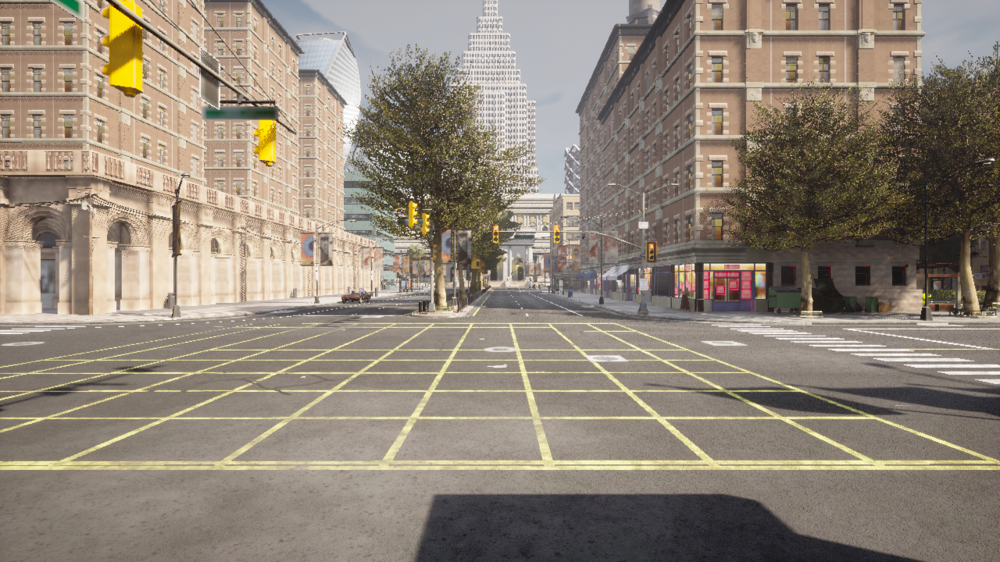

# CARLA Infrastructure Bootstrapping (RunPod 4090)

## Setup (RunPod):
- RTX 4090 (24GB VRAM) → ideal for Unreal + multiple sensors
- 31GB RAM → plenty
- 100GB disk → enough for CARLA + recordings
- ~$0.60/hr → reasonable for focused sessions

## Validation

`nvidia-smi` 
-> GPU is healthy

Initially tried to install docker, but got issues with docker-in-docker.

## Install Carla binary
```
apt-get update
apt-get install -y wget unzip libvulkan1 mesa-utils
```
ChatGPT: (Those Vulkan/Mesa bits prevent common “can’t init rendering” errors even in offscreen mode.)

```
mkdir -p /opt/carla
cd /opt/carla

wget -O CARLA_0.9.16.tar.gz https://tiny.carla.org/carla-0-9-16-linux
```
Note - the originally generated instructions were for 0.9.15; 0.9.16 is latest
-> 7.77G   101MB/s    in 80s

```
tar -xzf CARLA_0.9.16.tar.gz
```
This is a silent extraction, that can take 1-3 minutes; `tar -xzvf CARLA_0.9.16.tar.gz` is verbose.

## Install Dependencies

For Carla
```
apt-get install -y \
  libvulkan1 vulkan-tools \
  libxrandr2 libxinerama1 libxcursor1 libxi6 libxkbcommon0 \
  libglib2.0-0 libsm6 libice6 libfontconfig1 libnss3 \
  libxdamage1 libxfixes3 libxrender1 libxext6 libx11-6 \
  libpulse0 libasound2
```

For diagnostics
```
apt-get update && apt-get install -y iproute2
```

For video encoding (e.g. `scripts/images_to_video.py`)
```
apt-get install -y ffmpeg
```

mkdir -p /tmp/.X11-unix
chmod 1777 /tmp/.X11-unix

## Create a Carla user
I got an error: `Refusing to run with the root privileges.`
So, creating a user:
```
useradd -m -s /bin/bash carla
chown -R carla:carla /opt/carla
```

Switching to that user:
```
su - carla
```

Validating:
```
whoami
```
-> carla


## Start it headless:
```
chmod +x CarlaUE4.sh
cd /opt/carla
./CarlaUE4.sh -RenderOffScreen -carla-rpc-port=2000
```

## Second terminal window; running test script
Open new terminal window, follow instructions in runpod.

## Install python dependencies
```
pip install --upgrade pip
```

```
pip install carla==0.9.16
```

## Test that Carla is runnning and Python can access.

Initial Vulkan headless attempt → RenderThread timeout (segfault).
Root cause likely lack of valid GL context.

Fix:
- Installed Xvfb
- Created /tmp/.X11-unix
- Started Xvfb as root
- Ran Carla with -opengl -RenderOffScreen
- Verified RPC binding on :2000

## Setup terminal -> Cursor
My ideal setup here is 
- running Cursor on the remote machine via SSH, 
- get latest from github, be set up to read/write

One issue is that RunPod pods are semi-ephemeral: you can lose the underlying GPU day-to-day.

I added [infra/setup_runpod_carla.sh](../infra/setup_runpod_carla.sh) to update my local connection setup, and get the runpod pod setup with the right public keys + `carla` user. 

Usage:
Call the script, adding Runpod's provided connection string for SSH over exposed TCP
"Connect to your Pod using SSH over a direct TCP connection. (Supports SCP & SFTP)"
 
 Note there is a risk that what works on my machine isn't a good setup more generally.

```
./setup_runpod_carla.sh "ssh root@213.173.109.5 -p 17172 -i ~/.ssh/id_ed25519"
```

## Testing a CARLA render
Tested rendering a single image based on `capture_one_png.py`


