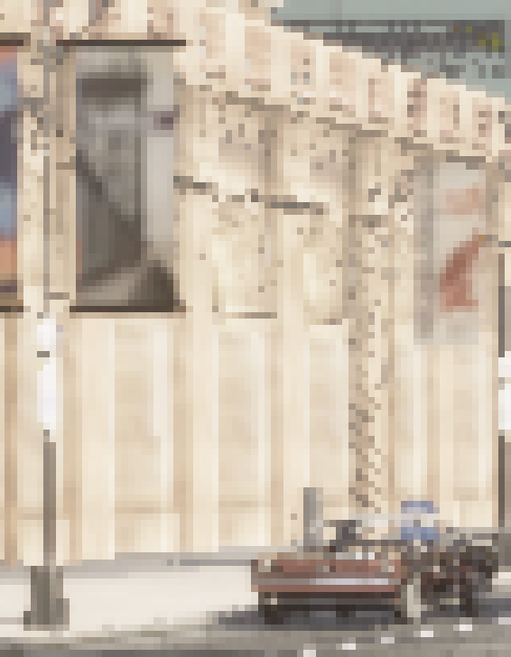
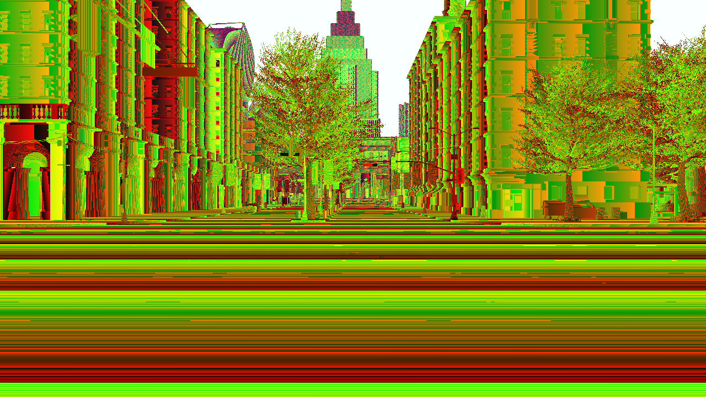
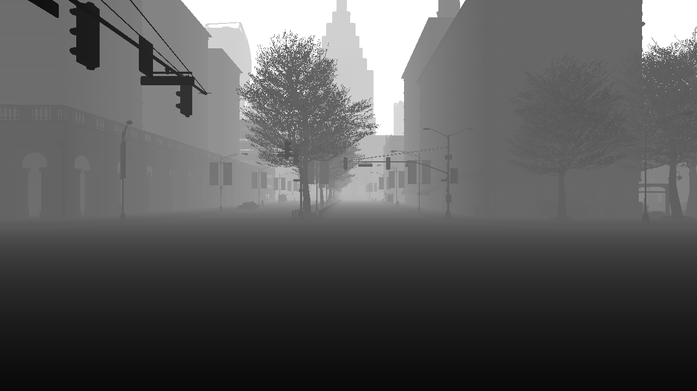
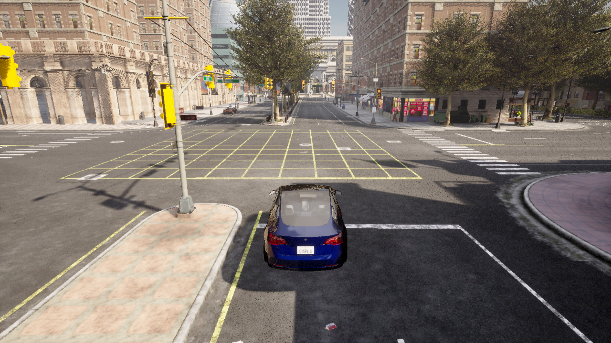
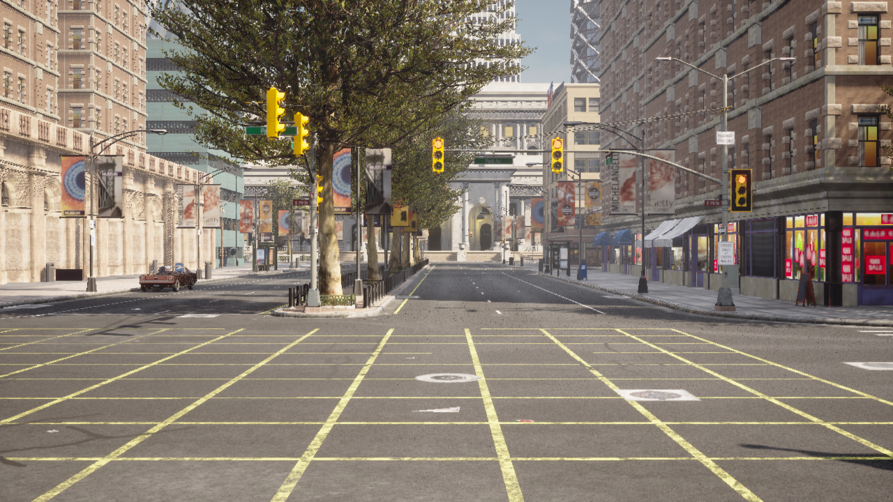
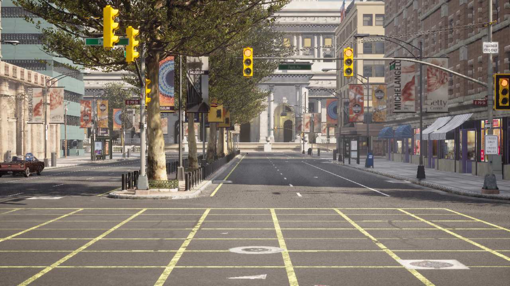
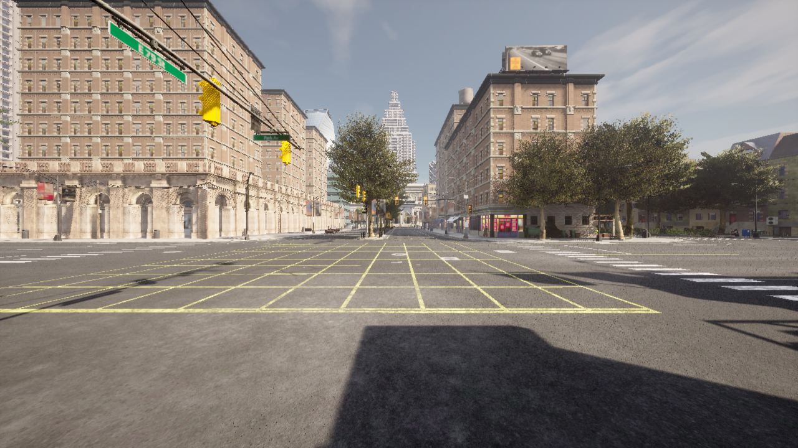

# Testing out-of-the-box rendering options

## RGB render (camera)
Looks like a realistic setting, but there are certainly pixelation artefacts that don't look like what I'd expect from a real camera.

ChatGPT confirms real cameras have
- optical blur
- sensor noise
- demosaicing artifacts
- compression artifacts

It's unclear to me how much this matters, but I doubt ChatGPT's assessment that it's "not a limitation if you're training segmentation"

## Depth (renderer ground-truth)
The first example of a depth capture was a bit confusing - with parallel lines where I'd expect more of a curve. I think that this is based on how depth has been encoded, which presumably is correct as a data type, but looks weird, with some modulo max depth creating a non-sensical render. 

Using the `carla.ColorConverter.LogarithmicDepth`, the image renders as a more intelligible greyscale.

## Segmentation
I reviewed segmentation output, and it looked like a mess. I decided to focus more narrowly on what sensors 'should' see in a simulation scenario, instead of what downstream processes might want.

## Rig
Rendering multiple images from different positions on the car worked as expected. 

I rendered a 'forward stack' of main / narrow / wide cameras based on the Tesla setup.

