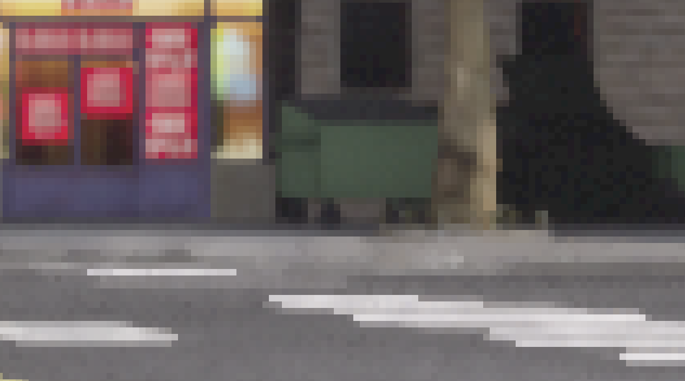
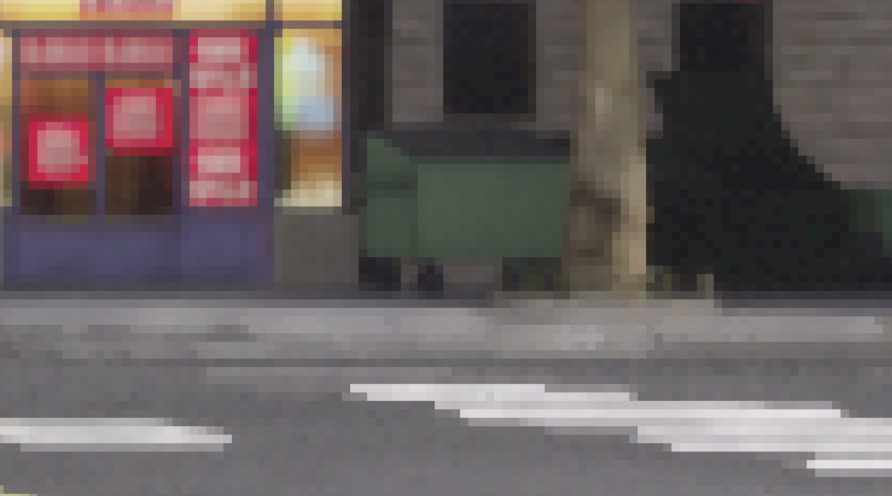
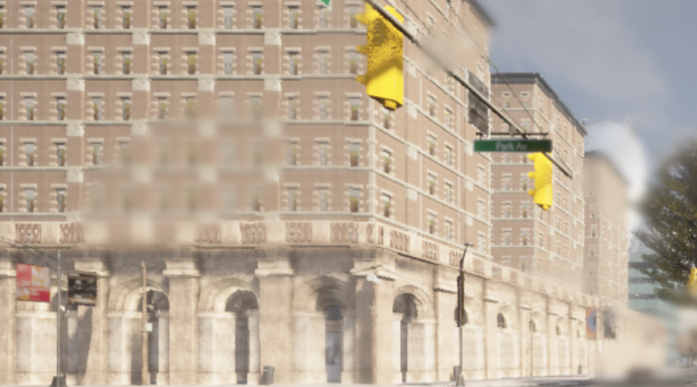
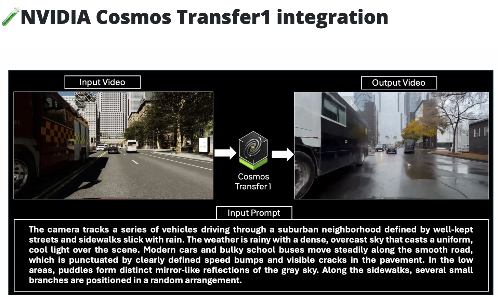
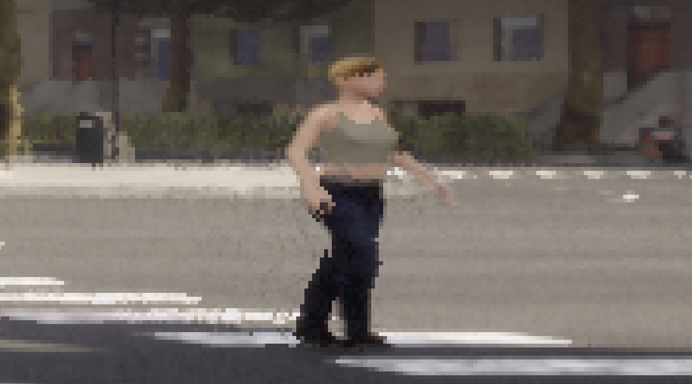
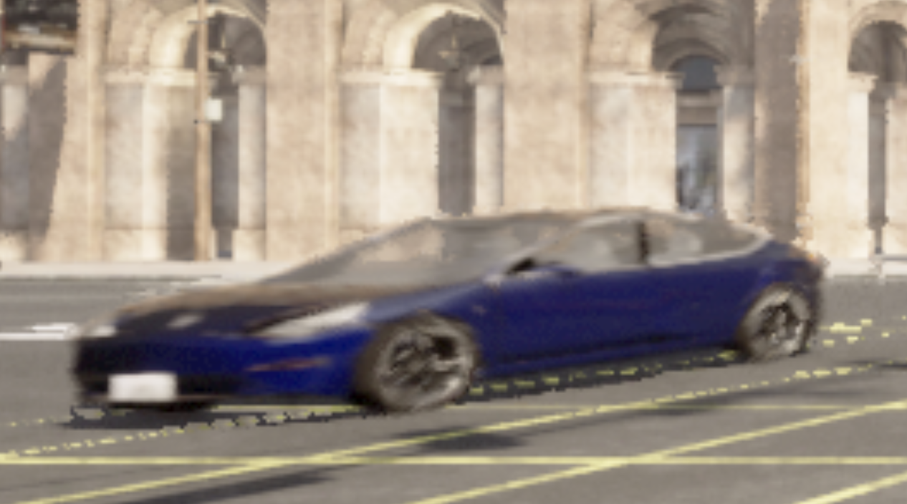

# Defining and documenting elements of the world

## Inspecting the world
The recommended approach is spectator navigation, but as far as I can tell, that's a different mental model for runpod (more of a remote desktop). 

Using script-based approaches is the more direct path for now.

Writing a simplified script to inspect elements of the world, including weather, I can see:
```
Map: Carla/Maps/Town10HD_Opt
Synchronous mode: False
Fixed delta seconds: None

Weather:
  Cloudiness: 20.0
  Precipitation: 0.0
  Wetness: 0.0  
  Sun altitude angle: 45.0

Actors:
  Vehicles: 0
  Walkers: 0
  Sensors: 0
  Traffic lights: 15

Spawn points available: 155
```

And inspecting the world at the end of the previous rendering stack, we see `Vehicles: 1` and `Sensors: 4` as expected.

```
Map: Carla/Maps/Town10HD_Opt
Synchronous mode: True
Fixed delta seconds: 0.1

Weather:
  Cloudiness: 20.0
  Precipitation: 0.0
  Wetness: 0.0
  Sun altitude angle: 45.0

Actors:
  Vehicles: 1
  Walkers: 0
  Sensors: 4
  Traffic lights: 15

Spawn points available: 155
```

I did check out the `world_snapshot`, but that object seems to serve a different purpose - a 'still image' of the actors and their positions, not including environment conditions.

## Variations on weather
See also https://carla.readthedocs.io/en/latest/core_world/#weather

### Sunset
Changing the position of the sun is a simple test.

Here's a recording from the front_wide RGB camera, while we update the world.


There's a slightly jarring dropping effect in the first few frames from the vehicle dropping when it's spawned. Left here for reference, fixed in later tests.

It's interesting to note that frame 45 (0 degrees) is when ALL lights turn on. As far as ChatGPT can tell I'd need to dig into the unreal settings to get a more realistic behaviour (with only some lights turning on gradually during twilight).

### Cloudiness


Some of these changes do seem abrupt in the render (the sky goes from "blue" to "gray" at ~0.35 cloudiness). 

The gif seems to have compression artefacts, which are not present in the source images. 

The flickering is actually present in the rendered images as you can see at cloudiness of .90 and .92 




### Precipitation and Wetness





I see some blurry splotches on precipitation images, and I get a wetness 'vibe' from those images, but I suspect I am hitting some limitations for the weather system with out-of-the-box approaches. 

My impression overal is that these weather parameters are a good starting point or approximationg. I amd guessing that can be 'good enough' depending on the context. 

It was interesting to see the release notes mention Style Transfer for increased realism here. This seems to also requires a reconstruction step for a full simulation experience. [See Cosmos Transfer1 in 0.9.16 release notes](https://carla.org/2025/09/16/release-0.9.16/).



## Variations on Actors

### Walker (crossing)
Added a walker crossing the sidewalk in view of the ego-vehicle. 


It feels like there are significant realism issues, from artefacting to lack of variation on character/motions (presets + loops), that can trip up a model in testing, or teach models to generalise based on incorrect patterns. 

Zooming in on artefacting and poses that feel quite stiff:


### Vehicle (oncoming)

Added a car crossing towards us. Made sure this was a fixed path and speed, instead of `autopilot(True)` for ease of testing.


Seeing the same kind of realism issues here, particularly perhaps around how the vehicle interacts with the enviroment, e.g. there are bright road markings in the shadow of the car.


